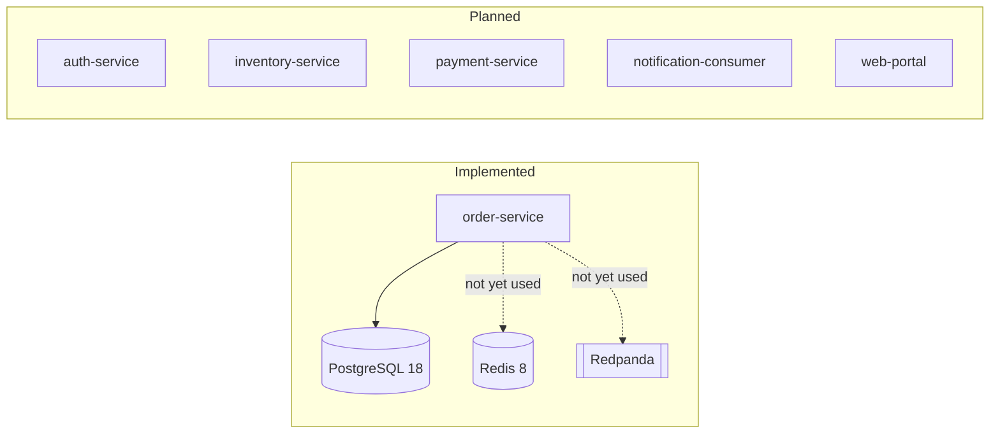

# FulfillX — Enterprise Quality Engineering Platform

FulfillX is a portfolio project pairing a realistic, controlled distributed
order-fulfillment system with the quality-engineering platform that
validates it. **The quality platform is the point** — the storefront exists
to give automated tests something real and risky to protect: inventory
overselling, duplicate payment authorization, payment uncertainty after
timeout, unauthorized refunds, duplicate/out-of-order event delivery,
poison messages, consumer-restart recovery, and API compatibility breaks.

This is not an e-commerce clone. It targets ~8 complete business workflows
with realistic success *and* failure behavior, backed by a risk-based test
strategy, real infrastructure (no mocks standing in for a "distributed
system"), and honestly-documented seeded defects.

## Current status: Phase 0 / Phase 1 (foundation) — Implemented

| Area | Status |
|---|---|
| Repository structure, `CLAUDE.md`, architecture/risk/strategy/traceability docs | **Implemented** |
| Root Maven reactor + Maven Wrapper (no system Maven required) | **Implemented** |
| `order-service`: Spring Boot 4.1.0 skeleton, Actuator health, `orders` table (Flyway), JPA entity | **Implemented** |
| One real integration test against a Testcontainers PostgreSQL instance | **Implemented** |
| `docker-compose.yml`: PostgreSQL 18, Redis 8, Redpanda — validated healthy locally | **Implemented** |
| GitHub Actions PR pipeline (Java 21 + Maven cache + `./mvnw clean verify`) | **Implemented** |
| Authentication, RBAC, inventory/payment/notification services, order business API, web portal | **Planned** |
| API automation (REST Assured), UI automation (Playwright), contract tests (Pact), event tests, concurrency tests, performance tests (k6) | **Planned** |
| Seeded defects (FX-001…FX-008) | **Planned** |

See `docs/roadmap/phased-delivery-plan.md` for the full phase sequence and
`CLAUDE.md` for the complete operating contract, including known
limitations.

## Architecture



Full diagrams and target architecture: `docs/architecture/`.

## Business risks this platform demonstrates

Full register: `docs/business-risks/business-risk-register.md`. As of this
phase, one risk has a proven, tested protection:

- **Duplicate order submission** (RISK-02): a unique database constraint on
  `orders.idempotency_key`, proven by
  `OrderPersistenceIntegrationTest#shouldRejectDuplicateIdempotencyKeyAtTheDatabaseLevel`
  against a real PostgreSQL 16 Testcontainers instance.

Everything else in the register is planned for later phases — see the
traceability doc for the live, honest mapping.

## Running it locally

Requires: Java 21, Docker Desktop (or equivalent), Git. **No system Maven
install is required** — this repo uses the Maven Wrapper.

```bash
# 1. Copy environment defaults (local dev only, not real secrets)
cp .env.example .env

# 2. Start infrastructure
docker compose up -d
docker compose ps        # confirm all three services report healthy

# 3. Run order-service against it
cd applications/order-service
../../mvnw spring-boot:run
# in another terminal:
curl http://localhost:8081/actuator/health

# 4. Tear down
docker compose down       # add -v to also remove data volumes
```

## Running the tests

```bash
./mvnw -B clean verify
```

This compiles `order-service` and runs its test suite, including one
integration test that spins up a real PostgreSQL container via
Testcontainers (requires Docker to be running).

## Evidence currently available

- Maven build output and test results from `./mvnw clean verify`
  (locally reproducible; also runs in CI on every PR/push via
  `.github/workflows/pr.yml`).
- `docker compose ps` output showing all three infrastructure containers
  healthy.
- `order-service` startup log showing a successful connection to the
  Compose-managed PostgreSQL instance, a successful Flyway migration, and
  `/actuator/health` returning `{"status":"UP"}`.

No Allure reports, Playwright traces, Pact contracts, or k6 results exist
yet — those arrive with their respective phases.

## Roadmap

See `docs/roadmap/phased-delivery-plan.md`. Next up (pending approval):
**Phase 2A — Authentication and identity foundation**.

## Honest limitations

See `CLAUDE.md` section 16 ("Known limitations") for the full, current
list — including that `order-service` has no business API yet beyond
health, `customer_id` has no foreign key target yet, order state
*transitions* aren't guarded yet (only valid *values* are), no outbox
pattern exists yet, and `order-service` isn't containerized yet.
