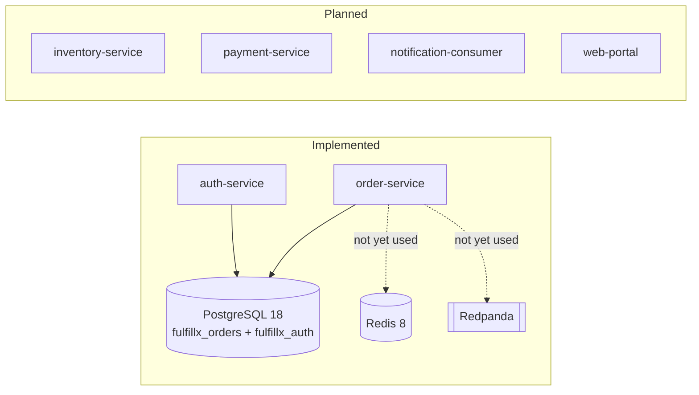

# FulfillX — Enterprise Quality Engineering Platform

FulfillX is a portfolio project pairing a realistic, controlled distributed
order-fulfillment system with the quality-engineering platform that
validates it. **The quality platform is the point** — the storefront exists
to give automated tests something real and risky to protect: inventory
overselling, duplicate payment authorization, payment uncertainty after
timeout, unauthorized refunds, duplicate/out-of-order event delivery,
poison messages, consumer-restart recovery, and API compatibility breaks.

This is not an e-commerce clone. It targets ~8 complete business workflows
with realistic success *and* failure behavior, backed by a risk-based test
strategy, real infrastructure (no mocks standing in for a "distributed
system"), and honestly-documented seeded defects.

## Current status: Phase 0, Phase 1 (foundation), and Phase 2A (identity) — Implemented

| Area | Status |
|---|---|
| Repository structure, `CLAUDE.md`, architecture/risk/strategy/traceability docs | **Implemented** |
| Root Maven reactor + Maven Wrapper (no system Maven required) | **Implemented** |
| `order-service`: Spring Boot 4.1.0 skeleton, Actuator health, `orders` table (Flyway), JPA entity | **Implemented** |
| `auth-service`: registration, login, JWT issuance/validation, `CUSTOMER`/`OPERATOR`/`ADMIN` roles, `/me` | **Implemented** |
| `docker-compose.yml`: PostgreSQL 18 (two logical databases), Redis 8, Redpanda — validated healthy locally | **Implemented** |
| GitHub Actions PR pipeline (Java 21 + Maven cache + `./mvnw clean verify`, full reactor) | **Implemented locally; not yet GitHub-validated** |
| Inventory/payment/notification services, order business API, web portal | **Planned** |
| API automation (REST Assured), UI automation (Playwright), contract tests (Pact), event tests, concurrency tests, performance tests (k6) | **Planned** |
| Seeded defects (FX-001…FX-008) | **Planned** |

See `docs/roadmap/phased-delivery-plan.md` for the full phase sequence and
`CLAUDE.md` for the complete operating contract, including known
limitations.

## Architecture



`order-service` and `auth-service` use **separate logical databases** with
no physical foreign key between them by design — see
`docs/decisions/ADR-002-identity-and-cross-service-data-ownership.md`.

Full diagrams and target architecture: `docs/architecture/`.

## Business risks this platform demonstrates

Full register: `docs/business-risks/business-risk-register.md`. As of this
phase:

- **Duplicate order submission** (RISK-02): a unique database constraint on
  `orders.idempotency_key`, proven against real PostgreSQL.
- **Unauthorized access** (RISK-07, partial): the identity/RBAC
  *foundation* now exists — real authentication, password hashing, bounded
  JWTs, and a `CUSTOMER`/`OPERATOR`/`ADMIN` role model, all proven by 16
  tests in `auth-service`. Endpoint-specific authorization (e.g. "a
  customer cannot refund another customer's order") isn't provable yet
  because the refund endpoint doesn't exist.

Everything else in the register is planned for later phases — see the
traceability doc for the live, honest mapping.

## Running it locally

Requires: Java 21, Docker Desktop (or equivalent), Git. **No system Maven
install is required** — this repo uses the Maven Wrapper.

```bash
# 1. Copy environment defaults (local dev only, not real secrets)
cp .env.example .env

# 2. Start infrastructure (creates both fulfillx_orders and fulfillx_auth
#    databases — see the note below if you have an older data volume)
docker compose up -d
docker compose ps        # confirm all three services report healthy

# 3. Run order-service and/or auth-service against it
cd applications/order-service && ../../mvnw spring-boot:run   # port 8081
cd applications/auth-service && ../../mvnw spring-boot:run    # port 8083
# in another terminal:
curl http://localhost:8081/actuator/health
curl http://localhost:8083/actuator/health

# 4. Try registration/login
curl -X POST http://localhost:8083/api/v1/auth/register \
  -H 'Content-Type: application/json' \
  -d '{"email":"demo@example.com","password":"correct-horse-battery"}'
curl -X POST http://localhost:8083/api/v1/auth/login \
  -H 'Content-Type: application/json' \
  -d '{"email":"demo@example.com","password":"correct-horse-battery"}'
# copy the accessToken from the response, then:
curl http://localhost:8083/api/v1/auth/me -H "Authorization: Bearer <token>"

# 5. Tear down
docker compose down       # add -v to also remove data volumes
```

If your `postgres-data` volume predates the `fulfillx_auth` database
(i.e. it existed before Phase 2A), run `docker compose down -v` once —
the database-creation script only runs against a fresh volume.

## Running the tests

```bash
./mvnw -B clean verify
```

This compiles and tests the **full reactor** (`order-service` +
`auth-service`), including integration tests that spin up real PostgreSQL
containers via Testcontainers (requires Docker to be running).

## Evidence currently available

- Maven build output and test results from `./mvnw clean verify` — 3 tests
  in `order-service`, 16 in `auth-service`, all passing (locally
  reproducible; also configured to run in CI on every PR/push via
  `.github/workflows/pr.yml`, though the workflow itself has not yet
  actually run on GitHub).
- `docker compose ps` output showing all three infrastructure containers
  healthy, with two logical Postgres databases provisioned.
- `auth-service` startup log showing a successful connection to its own
  Compose-managed PostgreSQL database, a successful Flyway migration, and
  `/actuator/health` returning `{"status":"UP"}`.
- Live registration → login → authenticated `/me` request cycle, run
  manually against the Compose stack.

No Allure reports, Playwright traces, Pact contracts, or k6 results exist
yet — those arrive with their respective phases.

## Roadmap

See `docs/roadmap/phased-delivery-plan.md`. Next up (pending approval):
**Phase 2 — First complete vertical slice** (register → order → payment →
confirm → event → audit).

## Honest limitations

See `CLAUDE.md` section 16 ("Known limitations") for the full, current
list — including that `customer_id` has no physical foreign key by design
(separate databases; see ADR-002), order state *transitions* aren't
guarded yet (only valid *values* are), no outbox pattern exists yet,
neither service is containerized yet, there's no endpoint to provision
`OPERATOR`/`ADMIN` accounts, and issued JWTs aren't revocable before their
(short, bounded) natural expiry.
