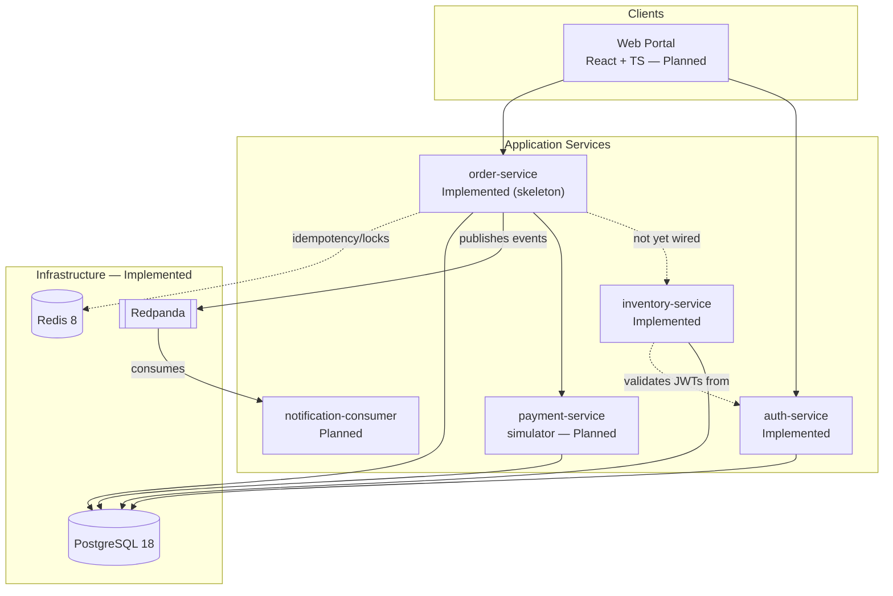

# Container Architecture

**Status: partially Planned.** Reflects the target architecture from the
build brief (section 7). `auth-service`, `inventory-service`, and
`order-service` (skeleton) plus the three infrastructure containers
(PostgreSQL, Redis, Redpanda) currently exist and run. `order-service` does
not yet call `inventory-service` — no order-creation endpoint exists to do
the calling from.

## Service responsibilities (target)

- **auth-service** — registration, login, password hashing, JWT issuance,
  roles (`CUSTOMER`, `OPERATOR`, `ADMIN`).
- **inventory-service** (*implemented*) — products, stock levels,
  reservation/release, atomic stock updates, overselling prevention. See
  `docs/decisions/ADR-003-inventory-consistency-and-atomic-reservation.md`
  for how the atomic-update and idempotency design works.
- **order-service** (*only one implemented so far, and only as a skeleton*)
  — order lifecycle orchestration, idempotent creation, coordination with
  inventory/payment, cancellation, refund initiation, shipment state, audit
  history, event publication.
- **payment-service** — deterministic payment simulator: success, decline,
  delay, timeout, "authorized but response lost," duplicate request,
  refund success/failure. Never touches real payment data.
- **notification-consumer** — consumes order events, records simulated
  notifications idempotently, dead-letter handling, restart recovery.

## Data ownership

Each service owns its own tables; no service reaches into another's schema
directly. Cross-service communication is HTTP (synchronous, orchestrated by
order-service) or events over Redpanda (asynchronous). See
`docs/architecture/data-ownership.md`.

## What exists today

- `order-service`: Actuator health only, plus the `orders` table and JPA
  entity. No business endpoints yet.
- `auth-service`: registration, login, `/me`, JWT issuance/validation, the
  `CUSTOMER`/`OPERATOR`/`ADMIN` role model.
- `inventory-service`: product and stock management, atomic idempotent
  reservation and release, JWT validation (reusing auth-service's signing
  secret, no network call to auth-service). Not yet called by any other
  service — `order-service` has no reservation-triggering endpoint yet.
- `docker-compose.yml`: PostgreSQL 18, Redis 8, Redpanda v26.1.12, each with
  health checks. Validated to start healthy and to be reachable by all
  three application services.
