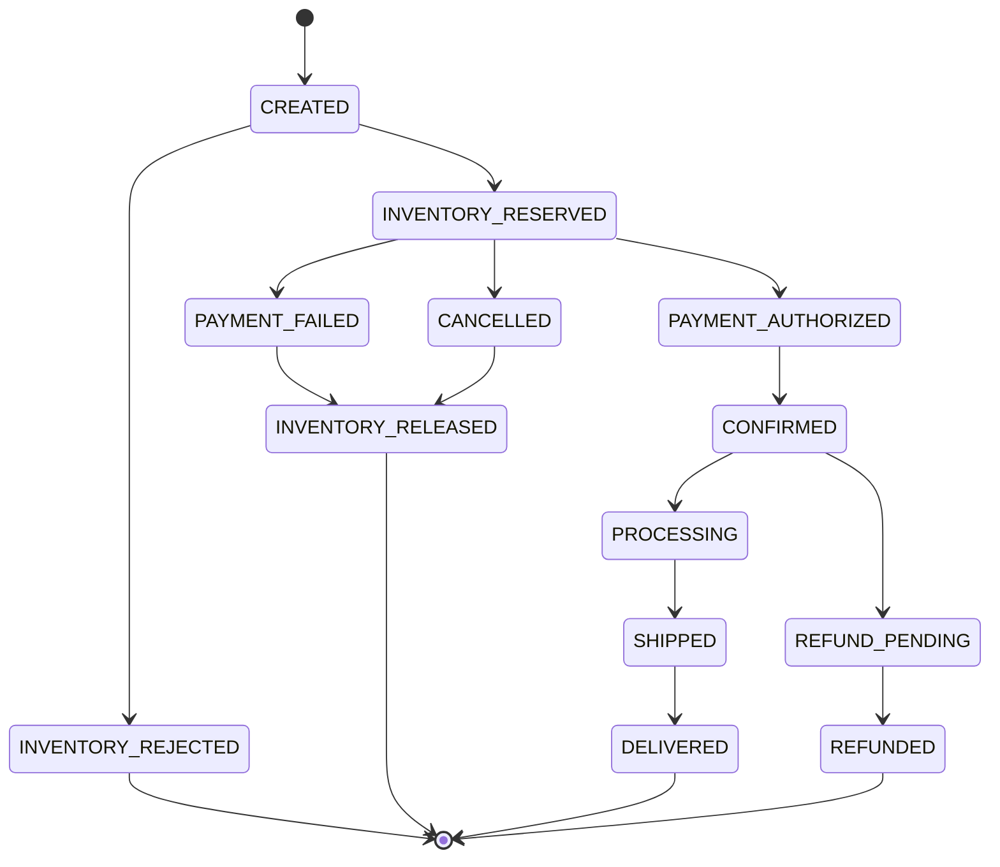

# Order Lifecycle

**Status: enum defined (Implemented). Transition-guard logic: Planned
(Phase 2).**

`OrderStatus` (`applications/order-service/src/main/java/com/fulfillx/orderservice/order/OrderStatus.java`)
defines the full state space today. A database `CHECK` constraint
(`ck_orders_status` in `V1__create_orders_table.sql`) restricts the
`status` column to these values. Nothing yet *enforces which transitions
are legal* — that is application/domain logic for Phase 2.

## States

## Explicitly illegal transitions (to be enforced in Phase 2)

These must be rejected by domain logic once it exists — they are not
rejected by anything today beyond "not a valid enum value":

- `DELIVERED → CREATED`
- `PAYMENT_FAILED → SHIPPED`
- Refunding an order that was never paid (no `PAYMENT_AUTHORIZED` /
  `CONFIRMED` in its history)
- Cancelling an order that is already fully `REFUNDED`
- Shipping an order that was never `CONFIRMED`
- Confirming an order without a successful `INVENTORY_RESERVED` step
- Completing an order without `PAYMENT_AUTHORIZED`

## Why this matters (business risk)

Illegal transitions are how "partial workflow completion" and "database
rollback failure" risks materialize in production order systems. See
`docs/business-risks/business-risk-register.md` for the full mapping. The
protection plan is: a domain-layer guard (Phase 2) backed by a unit test
per illegal transition, plus the state-value `CHECK` constraint already in
place as a database-layer backstop.
