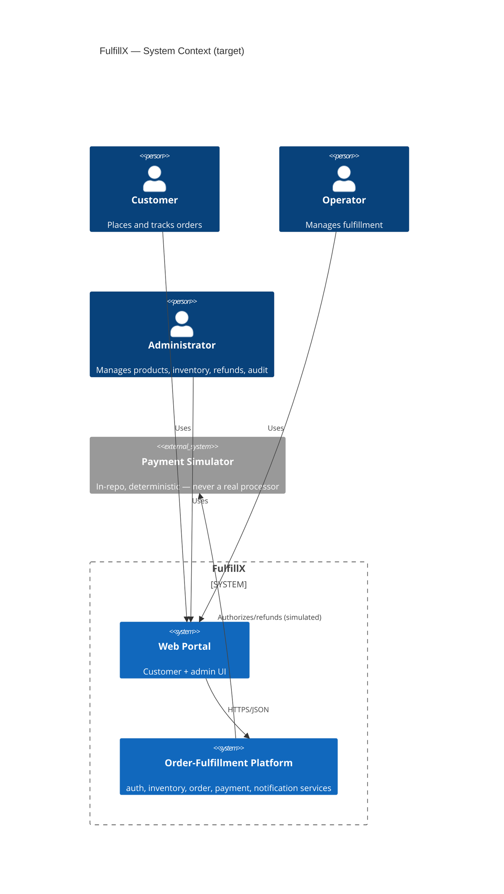

# System Context

**Status: mostly Planned.** Only `order-service` exists today. This document
describes the target system so future phases have a stable reference; it is
not a description of what currently runs.

## Actors and external systems

## Why this system exists

FulfillX is a controlled, realistic distributed order-fulfillment system
built specifically to give an automated quality-engineering platform
something worth protecting. See
`docs/business-risks/business-risk-register.md` for the specific risks each
part of the system is designed to expose and defend against.

## Current implementation status

| Component | Status |
|---|---|
| order-service (skeleton: health, `orders` table, entity) | **Implemented** |
| auth-service | Planned |
| inventory-service | Planned |
| payment-service (simulator) | Planned |
| notification-consumer | Planned |
| web-portal | Planned |
| order-service business API (create/reserve/authorize/confirm/cancel/refund) | Planned |
