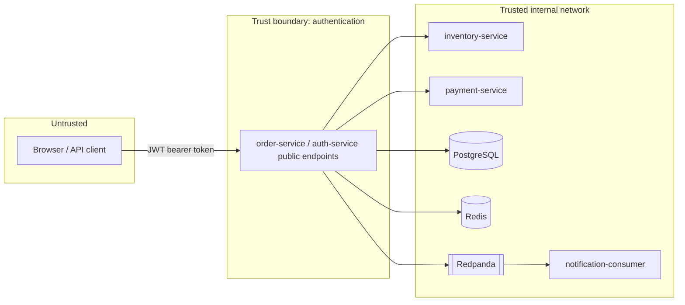

# Trust Boundaries

**Status: mostly Planned.** No authentication exists yet (Phase 2A). This
document records the target security model so it can be built against
consistently.

## Boundaries (target)

## Roles (target, not yet implemented)

| Role | Can do | Cannot do |
|---|---|---|
| `CUSTOMER` | Create/view own orders | Modify inventory, refund arbitrary orders, view other customers' orders |
| `OPERATOR` | Manage fulfillment state within defined rules | Manage products/inventory/refunds/audit access broadly |
| `ADMIN` | Manage products, inventory, refunds, audit access | N/A |

## Current state

- No authentication exists. `order-service` exposes only
  `/actuator/health` with default Actuator restrictions (`health,info`
  only — no `env`, `beans`, `heapdump`, etc. exposed).
- No JWT signing key, no password hashing, no RBAC — all Planned for
  Phase 2A per `docs/roadmap/phased-delivery-plan.md`.
- Database credentials for local development are non-production defaults
  in `.env.example` and are never committed as real secrets (`.env` is
  gitignored).

## Logging boundary

Structured logs must never contain passwords, JWT secrets, full
authorization tokens, real payment-card data, or other sensitive personal
information. No logging exists yet beyond Spring Boot's default console
output, which does not log request/response bodies.
