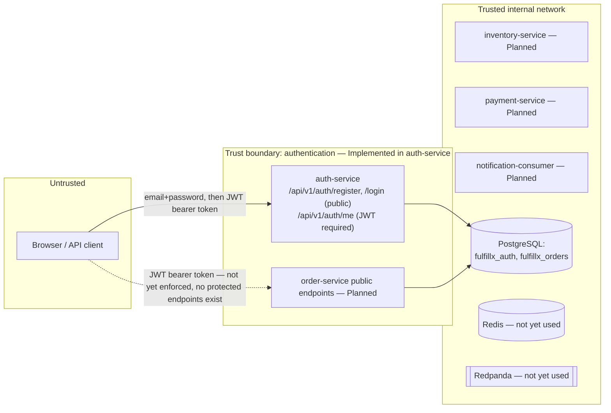

# Trust Boundaries

**Status: identity/RBAC foundation Implemented (Phase 2A). Endpoint-specific
authorization rules (e.g. refund ownership checks) remain Planned** since
the endpoints they'd protect don't exist yet.

## Boundaries

## Roles

| Role | Can do | Cannot do |
|---|---|---|
| `CUSTOMER` | Register, log in, view own identity (`/me`). Ordering endpoints: Planned. | Modify inventory, refund arbitrary orders, view other customers' orders (all Planned — no such endpoints exist yet to enforce this against) |
| `OPERATOR` | Same as above today; fulfillment-state management: Planned | Manage products/inventory/refunds/audit access broadly |
| `ADMIN` | Same as above today; product/inventory/refund/audit management: Planned | N/A |

Implemented today: the role model itself (`UserRole` enum, DB `CHECK`
constraint, JWT `role` claim) and the fact that public registration always
creates `CUSTOMER` — there is no endpoint that lets a caller self-assign
`OPERATOR`/`ADMIN`. **Not yet implemented:** any endpoint that actually
branches on role (e.g. `@PreAuthorize("hasRole('ADMIN')")`) — `auth-service`
today only distinguishes "authenticated" from "not authenticated," not
"authenticated as which role," at the authorization-decision level. That
arrives with the endpoints roles are meant to gate (inventory, refunds,
audit).

## Current state

- **Authentication is real and implemented**: BCrypt password hashing,
  HS256 JWTs (jjwt 0.13.0) with a bounded lifetime (30 minutes by
  default), issued only after password verification and an active-account
  check. JWT signing key comes from `AUTH_JWT_SECRET` with no hard-coded
  default — startup fails fast if it's unset.
- `order-service` still has no authentication of its own — it exposes only
  `/actuator/health`. Wiring order-service to validate auth-service-issued
  JWTs is Planned for Phase 2, when order-service gains endpoints worth
  protecting.
- Database credentials for local development remain non-production
  defaults in `.env.example`, shared between `order-service` and
  `auth-service` for local-dev simplicity (see ADR-002) and never
  committed as real secrets (`.env` is gitignored).
- Actuator exposure is restricted to `health,info` in both services.

## Logging boundary

Structured logs must never contain passwords, JWT secrets, full
authorization tokens, real payment-card data, or other sensitive personal
information. `auth-service` logs a rejected JWT only as its exception
class name (e.g. `ExpiredJwtException`) at debug level — never the token
itself, never the reason in a way that could help an attacker distinguish
"expired" from "tampered" from "malformed." Password hashes are never
included in any API response or log line.
