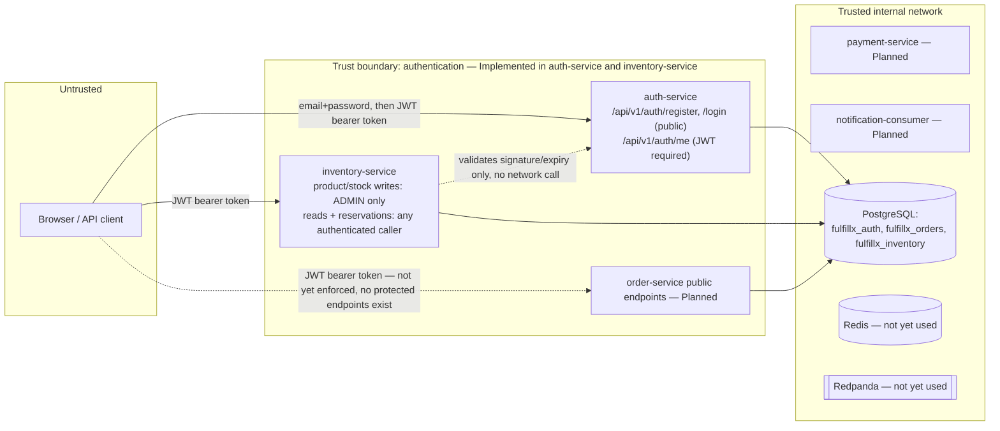

# Trust Boundaries

**Status: identity/RBAC foundation Implemented (Phase 2A), first
role-gated endpoints Implemented (Phase 2B, inventory-service).
Endpoint-specific *ownership* authorization rules (e.g. refund ownership
checks) remain Planned** since the endpoints they'd protect don't exist
yet.

## Boundaries

## Roles

| Role | Can do | Cannot do |
|---|---|---|
| `CUSTOMER` | Register, log in, view own identity (`/me`). Read products/inventory, create/release reservations (inventory-service). Ordering endpoints: Planned. | Create/modify products, adjust stock (inventory-service, `ADMIN` only), refund arbitrary orders, view other customers' orders (order-related checks Planned — no order endpoints exist yet to enforce this against) |
| `OPERATOR` | Same as `CUSTOMER` today against inventory-service (no operator-specific inventory rule exists yet); fulfillment-state management: Planned | Create/modify products, adjust stock; manage refunds/audit access broadly |
| `ADMIN` | Same as above today, plus product creation and stock adjustment in inventory-service; refund/audit management: Planned | N/A |

Implemented today: the role model itself (`UserRole` enum, DB `CHECK`
constraint, JWT `role` claim); public registration always creates
`CUSTOMER` — there is no endpoint that lets a caller self-assign
`OPERATOR`/`ADMIN`; and, new in Phase 2B, **the first endpoints that
actually branch on role** — inventory-service's `SecurityConfig` requires
`hasRole("ADMIN")` for `POST /api/v1/products` and `POST
/api/v1/inventory/{productId}/adjust`, proven by tests
(`shouldRejectProductCreationByCustomer`,
`shouldRejectStockAdjustmentByNonAdmin`). `auth-service` itself still only
distinguishes "authenticated" from "not authenticated" at its own
authorization-decision level — role-gating happens in the services that
consume its tokens, not in auth-service.

Inventory-service's reservation endpoints (`POST
/api/v1/inventory/reservations` and its `/release` counterpart) are
"any authenticated caller" rather than role- or identity-restricted — this
is a **documented, temporary** limitation, not an oversight: there is no
service-to-service authentication mechanism yet, and order-service (the
eventual real caller) has no endpoint of its own to call from in this
phase. See CLAUDE.md's Known Limitations and
`docs/decisions/ADR-003-inventory-consistency-and-atomic-reservation.md`'s
Consequences section.

## Current state

- **Authentication is real and implemented**: BCrypt password hashing,
  HS256 JWTs (jjwt 0.13.0) with a bounded lifetime (30 minutes by
  default), issued only after password verification and an active-account
  check. JWT signing key comes from `AUTH_JWT_SECRET` with no hard-coded
  default — startup fails fast if it's unset.
- **inventory-service validates those same JWTs locally**, offline — same
  signing secret, signature/expiry verification only, no network call back
  to auth-service on any request. This is the first proof that ADR-002's
  identity pattern ("a valid JWT is itself the integrity proof") works for
  a service other than the one that issued the token.
- `order-service` still has no authentication of its own — it exposes only
  `/actuator/health`. Wiring order-service to validate auth-service-issued
  JWTs is Planned for Phase 2, when order-service gains endpoints worth
  protecting.
- Database credentials for local development remain non-production
  defaults in `.env.example`, shared between `order-service` and
  `auth-service` for local-dev simplicity (see ADR-002) and never
  committed as real secrets (`.env` is gitignored).
- Actuator exposure is restricted to `health,info` in both services.

## Logging boundary

Structured logs must never contain passwords, JWT secrets, full
authorization tokens, real payment-card data, or other sensitive personal
information. `auth-service` logs a rejected JWT only as its exception
class name (e.g. `ExpiredJwtException`) at debug level — never the token
itself, never the reason in a way that could help an attacker distinguish
"expired" from "tampered" from "malformed." Password hashes are never
included in any API response or log line.
